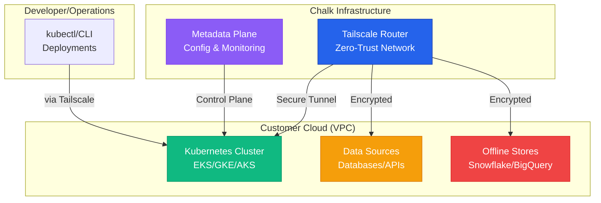

import { TipInfo, TipGood, TipBad } from '@/components/Tip'
import { HighlightsGrid } from '@/components/HighlightsGrid'

Connecting your infrastructure to Chalk requires establishing secure network connectivity across four critical paths: Kubernetes cluster access, metadata plane communication, data source integration, and offline store operations.

Chalk uses **Tailscale routing as the standard connectivity approach for all new deployments**, providing modern zero-trust networking with minimal configuration overhead. This approach eliminates traditional networking complexity like manual firewall rules, IP allowlisting, and exposed public endpoints.

This guide walks you through Chalk's connectivity architecture, explains how Tailscale routing works, and provides quick-start paths for common deployment scenarios.

---

## Connection Types

Chalk infrastructure requires connectivity across four distinct paths, each serving a specific purpose in your deployment.

### Kubernetes Cluster Access

The Kubernetes API server requires secure access for deployments, management operations, and monitoring. Chalk connects to your EKS, GKE, or AKS clusters using Tailscale to provide encrypted, authenticated access without exposing the API server publicly.

[Learn more about Kubernetes connectivity →](/docs/connectivity-kubernetes)

### Metadata Plane Communication

The metadata plane handles configuration, monitoring, alerting, and feature discovery. This control plane does **not** have access to customer data and communicates with your infrastructure for orchestration and observability.

[Learn more about metadata plane connectivity →](/docs/connectivity-metadata-plane)

### Data Source Integration

Feature computation requires real-time access to your data sources including databases (PostgreSQL, MySQL), data warehouses (Snowflake, BigQuery), and APIs. Tailscale provides secure, encrypted connectivity to these resources.

[Learn more about data source connectivity →](/docs/connectivity-datasources)

### Offline Store Operations

Historical feature storage and training set generation require connectivity to offline stores like BigQuery, Snowflake, or Delta Lake. These connections handle large-scale data operations for model training and backfilling.

[Learn more about offline store connectivity →](/docs/connectivity-offline-stores)

---

## Connectivity Architecture

The following diagram illustrates how Tailscale routing connects all four infrastructure paths with zero-trust security.

All traffic flows through **Tailscale's zero-trust network layer**, which provides point-to-point encrypted tunnels using WireGuard protocol. This architecture eliminates the need for exposed public endpoints, manual firewall configuration, or IP allowlisting.

---

## Tailscale Routing: The Standard Approach

Chalk uses Tailscale routing as the supported connectivity method for all new deployments. This modern approach provides enterprise-grade security with operational simplicity.

### Why Tailscale

<TipGood>
Tailscale routing eliminates manual firewall rule updates, IP allowlisting, and exposed public endpoints while providing enterprise-grade zero-trust security.
</TipGood>

**Zero-Trust Security Model**
Every connection is authenticated and encrypted with automatic certificate rotation. No implicit trust based on network location.

**No Firewall Management**
Eliminate the operational overhead of managing firewall rules, security groups, and IP allowlists across clouds.

**Cloud-Agnostic**
Works identically across AWS, GCP, Azure, and on-premises infrastructure. Multi-cloud deployments are simple.

**Minimal Configuration**
Typical setup time is under 1 hour. No complex VPN appliances or networking knowledge required.

**Automatic Certificate Rotation**
WireGuard keys rotate automatically without manual intervention or service disruption.

### How It Works

Tailscale creates a **virtual private network** across your infrastructure using the WireGuard protocol:

1. **Identity-Based Access**: Authentication integrates with your existing identity provider (Okta, Azure AD, etc.)
2. **Point-to-Point Tunnels**: Direct encrypted connections between endpoints, no central chokepoint
3. **Automatic Discovery**: Nodes automatically discover each other without manual configuration
4. **Split DNS**: Internal DNS resolution works seamlessly across the network

<TipGood>
Tailscale's coordination server never sees your traffic or data—it only facilitates peer discovery and key exchange.
</TipGood>

### Deployment Process

Setting up Tailscale connectivity typically takes under 1 hour:

1. Install Tailscale client on target infrastructure
2. Authenticate with your identity provider
3. Configure subnet routing (if needed)
4. Verify connectivity with Chalk infrastructure

For detailed setup instructions, see the cloud-specific guides in the Quick Start section below.

---

## Quick Start: Choose Your Path

Select your scenario below for specific setup instructions.

<HighlightsGrid
  title="Common Connectivity Scenarios"
  links={[
    {
      href: '/docs/connectivity-paradigms',
      name: 'New AWS Deployment',
      description: 'Set up Tailscale routing for EKS clusters and RDS databases.'
    },
    {
      href: '/docs/connectivity-paradigms',
      name: 'New GCP Deployment',
      description: 'Configure Tailscale for GKE clusters and BigQuery access.'
    },
    {
      href: '/docs/connectivity-paradigms',
      name: 'New Azure Deployment',
      description: 'Establish Tailscale connectivity for AKS and Azure SQL.'
    },
    {
      href: '/docs/connectivity-paradigms',
      name: 'Multi-Cloud Setup',
      description: 'Connect infrastructure across AWS, GCP, and Azure.'
    },
    {
      href: '/docs/connectivity-paradigms',
      name: 'VPC Peering (Alternative)',
      description: 'Use VPC peering for same-cloud, same-region deployments.'
    },
    {
      href: '/docs/connectivity-kubernetes',
      name: 'Kubernetes Access Only',
      description: 'Connect to existing K8s clusters for deployments.'
    },
    {
      href: '/docs/connectivity-datasources',
      name: 'Data Source Integration',
      description: 'Connect Chalk to existing databases and APIs.'
    },
    {
      href: '/docs/connectivity-offline-stores',
      name: 'Offline Store Setup',
      description: 'Configure connectivity to data warehouses.'
    },
    {
      href: '/docs/connectivity-paradigms',
      name: 'Migrate from IP Allowlisting',
      description: 'Transition legacy deployments to Tailscale routing.'
    },
    {
      href: '/docs/connectivity-troubleshooting',
      name: 'Troubleshooting',
      description: 'Diagnose and resolve connectivity issues.'
    }
  ]}
/>

---

## Alternative Connectivity Approaches

While Tailscale is the standard, Chalk supports alternative connectivity methods for specific scenarios.

### VPC Peering

VPC peering is available for deployments where both Chalk infrastructure and customer resources are in the same cloud provider and region.

**Use Cases:**
- Same-cloud, same-region deployments with existing VPC infrastructure
- Organizational policies requiring native cloud networking
- Direct VPC-to-VPC connectivity requirements

**Trade-offs:**
- Regional limitation (no cross-region or multi-cloud)
- Increased operational complexity (peering requests, route table management)
- Manual firewall rule configuration required
- Tighter coupling to specific cloud provider

<TipInfo>
VPC peering is available as an alternative for same-cloud, same-region deployments but requires additional operational overhead compared to Tailscale routing.
</TipInfo>

[Learn more about VPC peering setup →](/docs/connectivity-paradigms)

### IP Allowlisting (Deprecated)

<TipBad>
IP allowlisting is **deprecated** and not supported for new Chalk deployments. Existing customers using IP allowlisting should plan migration to Tailscale routing.
</TipBad>

**For Legacy Deployments Only:**

If you have an existing deployment using IP allowlisting, you can reference the current static IP addresses at [/docs/static-ips](/docs/static-ips). However, this approach:

- Requires manual firewall rule management
- Exposes public endpoints
- Lacks zero-trust security model
- Has operational overhead for IP changes
- Is not supported for new deployments

**Migration Required:**

All deployments using IP allowlisting should migrate to Tailscale routing. See the [connectivity paradigms guide](/docs/connectivity-paradigms) for migration details and timeline.

---

## Network Security and Compliance

Chalk's connectivity architecture is designed with security and compliance as core principles.

### Zero-Trust Architecture

Every connection is authenticated and authorized based on identity, not network location. No implicit trust is granted.

- **Identity-based authentication** via existing IdP (Okta, Azure AD, etc.)
- **End-to-end encryption** using WireGuard protocol
- **Automatic certificate rotation** without manual intervention
- **No exposed public endpoints** for infrastructure resources

### Compliance and Certifications

Chalk's security program is certified against industry standards:

- **SOC 2 Type 2** - Independent audit of security controls
- **ISO 27001:2022** - Information security management system
- **GDPR compliant** - Data privacy and protection
- **HIPAA-ready** - Health data security requirements

### Audit Logging and Monitoring

All connectivity events are logged for audit and troubleshooting:

- Connection attempts (successful and failed)
- Authentication events
- Network policy changes
- Data access patterns

For comprehensive security details, see the [Network Security Best Practices](/docs/connectivity-security) and [Platform Architecture](/docs/architecture) pages.

---

## Additional Resources

### Detailed Connectivity Guides

- **[Connectivity Paradigms](/docs/connectivity-paradigms)** - Tailscale setup with VPC peering and legacy IP allowlisting reference
- **[Kubernetes Connectivity](/docs/connectivity-kubernetes)** - Detailed guide for K8s cluster access and management
- **[Data Source Connectivity](/docs/connectivity-datasources)** - Comprehensive integration guide for databases and APIs
- **[Offline Store Connectivity](/docs/connectivity-offline-stores)** - Connecting to data warehouses and historical storage
- **[Network Architecture](/docs/connectivity-network-architecture)** - Deep dive into network topology and traffic patterns
- **[Metadata Plane Connectivity](/docs/connectivity-metadata-plane)** - Configuration and monitoring plane integration
- **[Connectivity Troubleshooting](/docs/connectivity-troubleshooting)** - Diagnostic procedures and common issues
- **[Network Security Best Practices](/docs/connectivity-security)** - Security best practices and compliance information

### Legacy and Migration

- **[Static IP Addresses (Legacy)](/docs/static-ips)** - IP addresses for legacy deployments (deprecated)

### Related Documentation

- **[Platform Architecture](/docs/architecture)** - Platform architecture overview
- **[Enterprise Deployment](/docs/deployment)** - Deployment models and infrastructure
- **[Security Overview](/docs/security)** - Comprehensive security documentation
- **[Tailscale Documentation](https://tailscale.com/kb/)** - Official Tailscale knowledge base

### Support

For connectivity questions or issues, contact Chalk through your support channel or email [support@chalk.ai](mailto:support@chalk.ai).
